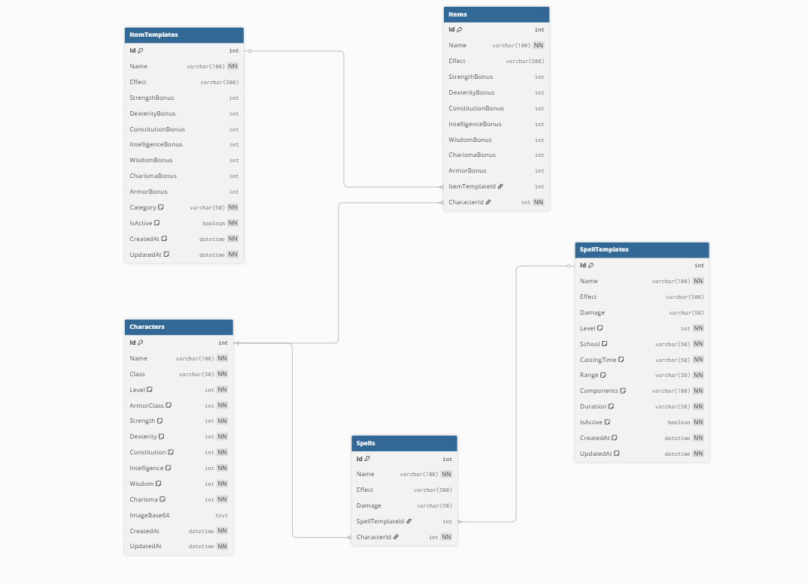
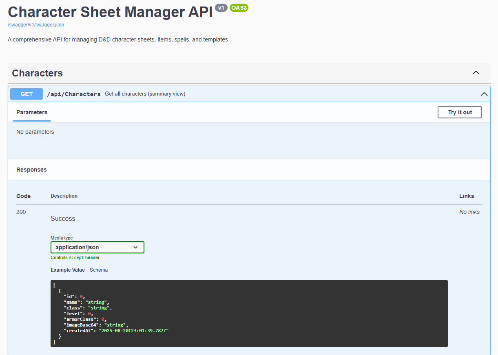
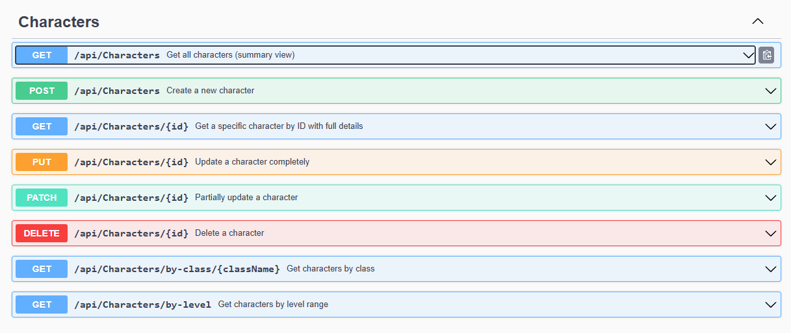
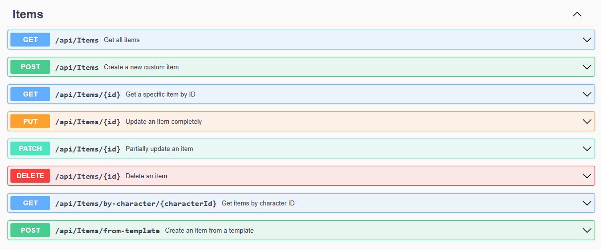
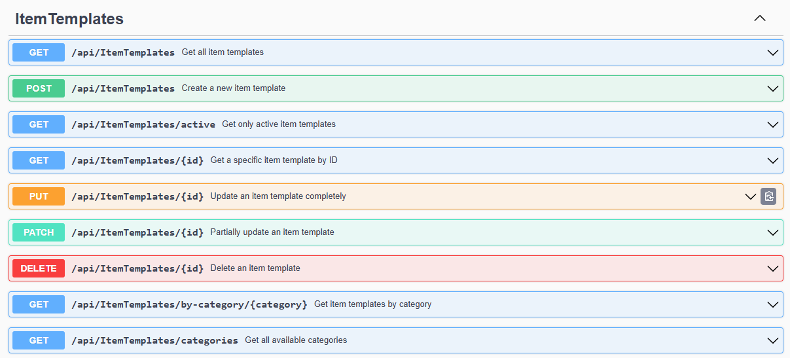
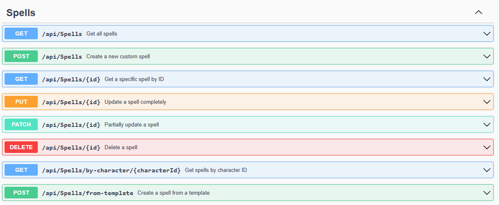
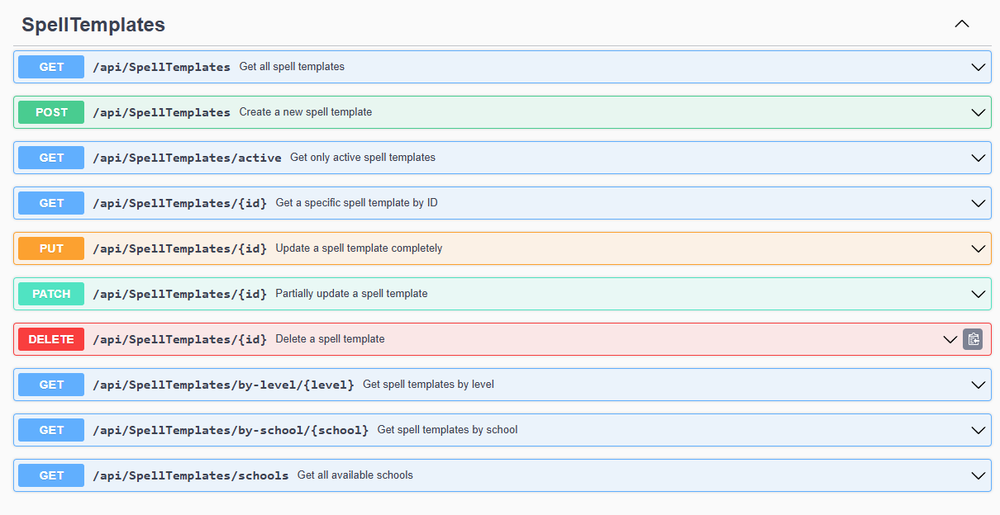

# Character Sheet Manager API

A comprehensive RESTful API for managing D&D character sheets, items, spells, and templates built with .NET 9.0 and Entity Framework Core.

## 🚀 Features

- **Character Management**: Create, read, update, and delete D&D characters with full stat tracking
- **Item System**: Manage character items with stat bonuses and template support
- **Spell System**: Handle character spells with template-based system
- **Template Management**: Reusable item and spell templates for consistency
- **Advanced Operations**: Support for PATCH operations, partial updates, and complex queries
- **Validation**: Comprehensive input validation and business rule enforcement
- **Error Handling**: Global exception handling with structured error responses
- **Auto-mapping**: Efficient object mapping with AutoMapper
- **Database**: SQL Server with Entity Framework Core migrations
- **API Documentation**: Swagger/OpenAPI integration

## 📋 Prerequisites

- [.NET 9.0 SDK](https://dotnet.microsoft.com/download/dotnet/9.0)
- [SQL Server](https://www.microsoft.com/en-us/sql-server/sql-server-downloads) (LocalDB or Express)
- [Visual Studio 2022](https://visualstudio.microsoft.com/) or [VS Code](https://code.visualstudio.com/)

## 🛠️ Installation & Setup

1. **Clone the repository**
   ```bash
   git clone <repository-url>
   cd backend
   ```

2. **Configure Database Connection**
   
   Update `appsettings.json` with your SQL Server connection string:
   ```json
   {
     "ConnectionStrings": {
       "DefaultConnection": "Server=localhost\\SQLEXPRESS;Database=CharacterSheetDb;Trusted_Connection=True;TrustServerCertificate=True;"
     }
   }
   ```

3. **Install Dependencies**
   ```bash
   dotnet restore
   ```

4. **Run Database Migrations**
   ```bash
   dotnet ef database update
   ```

5. **Start the Application**
   ```bash
   dotnet run
   ```

6. **Access the API**
   - API Base URL: `https://localhost:5126`
   - Swagger UI: `https://localhost:5126` (development only)

## 📊 Database Schema



The application uses the following main entities:

- **Characters**: Core character data with stats and metadata
- **Items**: Character equipment with stat bonuses
- **Spells**: Character spells with effects and templates
- **ItemTemplates**: Reusable item definitions
- **SpellTemplates**: Reusable spell definitions with D&D 5e properties

## 🔧 API Endpoints

### Characters
```
GET    /api/characters              - Get all characters (summary)
GET    /api/characters/{id}         - Get character by ID (detailed)
POST   /api/characters              - Create new character
PUT    /api/characters/{id}         - Update entire character
PATCH  /api/characters/{id}         - Partially update character
DELETE /api/characters/{id}         - Delete character
GET    /api/characters/class/{name} - Get characters by class
GET    /api/characters/level        - Get characters by level range
```

### Items
```
GET    /api/items                   - Get all items
GET    /api/items/{id}              - Get item by ID
POST   /api/items                   - Create new item
PUT    /api/items/{id}              - Update item
DELETE /api/items/{id}              - Delete item
GET    /api/items/character/{id}    - Get items by character
```

### Spells
```
GET    /api/spells                  - Get all spells
GET    /api/spells/{id}             - Get spell by ID
POST   /api/spells                  - Create new spell
PUT    /api/spells/{id}             - Update spell
DELETE /api/spells/{id}             - Delete spell
GET    /api/spells/character/{id}   - Get spells by character
```

### Templates
```
GET    /api/itemtemplates           - Get all item templates
POST   /api/itemtemplates           - Create item template
GET    /api/spelltemplates          - Get all spell templates  
POST   /api/spelltemplates          - Create spell template
```

## 📝 Sample API Requests

### Create a Character
```json
POST /api/characters
{
  "name": "Gandalf the Grey",
  "class": "Wizard",
  "level": 15,
  "armorClass": 12,
  "strength": 10,
  "dexterity": 13,
  "constitution": 16,
  "intelligence": 20,
  "wisdom": 15,
  "charisma": 16,
  "imageBase64": null
}
```

### Partial Character Update (PATCH)
```json
PATCH /api/characters/1
{
  "level": 16,
  "intelligence": 21
}
```




## 🏗️ Architecture

### Project Structure
```
├── Controllers/           # API controllers
├── Data/                 # Database context
├── Dtos/                # Data transfer objects
├── Entities/            # Database models
├── Mapping/             # AutoMapper profiles
├── Middleware/          # Custom middleware
├── Repositories/        # Data access layer
├── Services/            # Business logic layer
├── Migrations/          # EF Core migrations
└── Properties/          # Application settings
```

### Key Design Patterns
- **Repository Pattern**: Clean data access abstraction
- **Service Layer**: Business logic separation
- **Dependency Injection**: Built-in .NET DI container
- **DTO Mapping**: AutoMapper for object transformations
- **Exception Handling**: Global middleware for consistent error responses

## ⚙️ Configuration

### Environment Variables
```bash
ASPNETCORE_ENVIRONMENT=Development
ASPNETCORE_URLS=https://localhost:5126
```

### Business Rules
- Character stats must be between 1-20
- Total character stats cannot exceed 90 points
- Character level must be between 1-20
- Armor class must be between 1-30


## 📦 Dependencies

### Core Dependencies
- **Microsoft.AspNetCore.OpenApi** (9.0.8) - API documentation
- **Microsoft.EntityFrameworkCore.SqlServer** (9.0.8) - Database provider
- **AutoMapper** (12.0.1) - Object mapping
- **Swashbuckle.AspNetCore** (6.5.0) - Swagger integration

### Development Tools
- **Microsoft.EntityFrameworkCore.Design** (9.0.8) - EF migrations
- **Microsoft.EntityFrameworkCore.Tools** (8.0.0) - Package manager tools

## 🚀 Deployment

### Development
```bash
dotnet run --environment Development
```

## 📚 API Documentation

When running in development mode, comprehensive API documentation is available via Swagger UI at the root URL. You can populate the database using ***input_script.py*** python script, whenever.  The documentation includes:

- Complete endpoint descriptions
- Request/response schemas
- Example payloads
- Authentication requirements
- Error response formats





